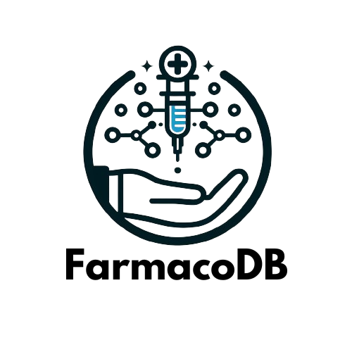
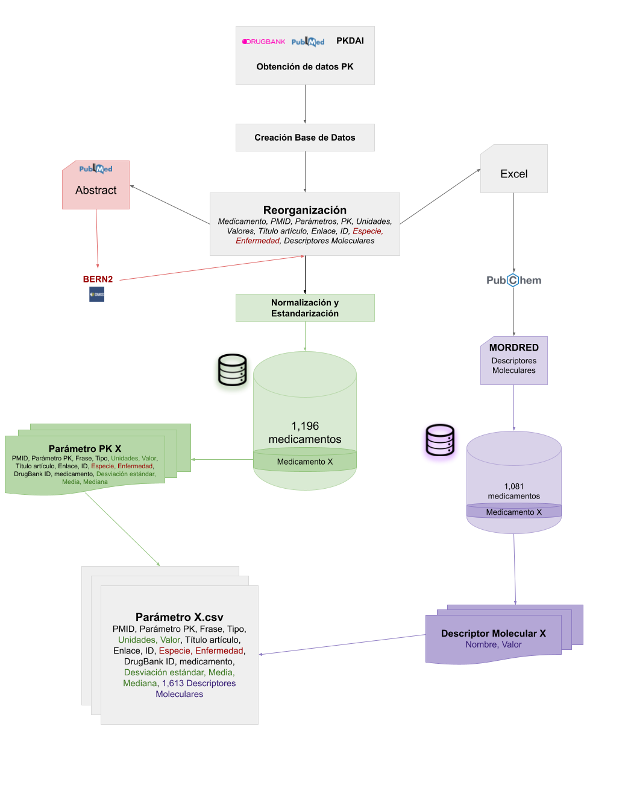
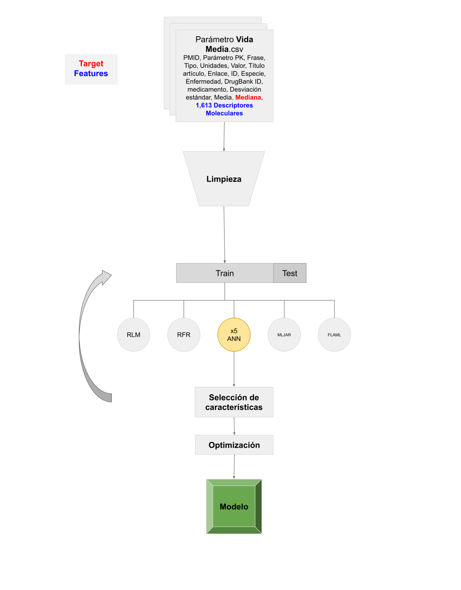
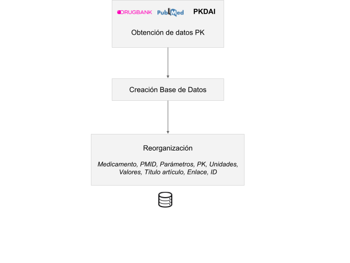
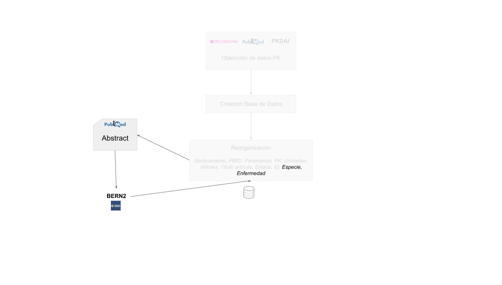
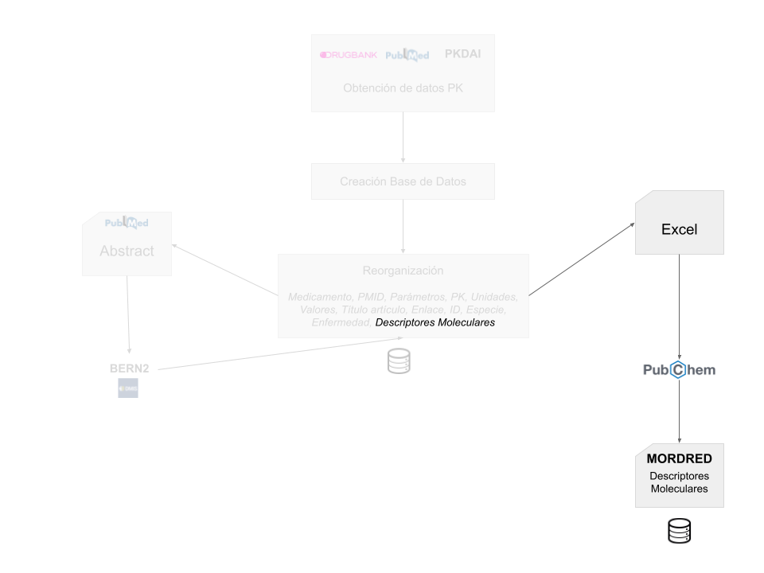
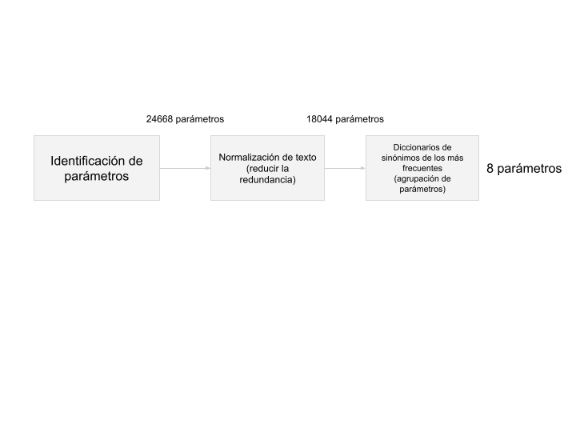

# FarmacoDB: Automatización de Extracción y Análisis de Datos


# Índice
- [FarmacoDB: Automatización de Extracción y Análisis de Datos](#farmacodb-automatización-de-extracción-y-análisis-de-datos)
  - [Descripción](#descripción)
  - [Objetivos](#objetivos)
  - [Metodología](#metodología)
    - [Bases de Datos (BBDD Farmacocinética + BBDD Descriptores)](#bases-de-datos-bbdd-farmacocinética--bbdd-descriptores)
      - [1. Extracción de Datos PK de PKPDAI y DrugBank](#1-extracción-de-datos-pk-de-pkpdai-y-drugbank)
      - [2. Minería de Texto para Extracción de "Especie" y "Enfermedad"](#2-minería-de-texto-para-extracción-de-especie-y-enfermedad)
      - [3. Extracción de Descriptores Moleculares](#3-extracción-de-descriptores-moleculares)
      - [4, 5, 6, 7. Limpieza de Datos y Normalización](#4-5-6-7-limpieza-de-datos-y-normalización)
      - [8. Integración en csv para el modelo](#8-integración-en-csv-para-el-modelo)
    - [Desarrollo del Modelo Predictivo](#desarrollo-del-modelo-predictivo)
      - [Consideraciones](#consideraciones)
      - [Limpieza de Datos](#limpieza-de-datos)
      - [Normalización y Estandarización](#normalización-y-estandarización)
      - [Modelos](#modelos)
        - [Pipeline Finalista](#pipeline-finalista)
        - [Pipeline Completo](#pipeline-completo)
  - [Estructura del Repositorio](#estructura-del-repositorio)
  - [Instrucciones de Uso](#instrucciones-de-uso)
  - [Agradecimientos](#agradecimientos)
  - [Contribución](#contribución)
  - [Licencia](#licencia)
  - [Autores](#autores)
  - [Referencias](#referencias)

## Descripción
Este repositorio se enfoca en automatizar la extracción y análisis de datos farmacocinéticos de diversas fuentes, con el fin de obtener una base de datos integral y estandarizada de información farmacocinética junto con los scripts de creación y análisis, dirigidos a resolver los retos de la individualización en farmacología debido a la escasez de bases de datos completas  ([Wang et al., 2009](https://pubmed.ncbi.nlm.nih.gov/19345282/ "Wang et al., 2009")). Finalmente  se incluye la implementación de un modelo predictivo para la vida media de medicamentos en humanos.
Se emplearon técnicas avanzadas de minería de texto y modelos de lenguaje para obtener datos esenciales con **un total de 1,130 fármacos, representados por 100,359 registros de parámetros farmacocinéticos**. 

Este repositorio proporciona la **metodología y los scripts necesarios para replicar el proceso de creación de la base de datos y del modelo predictivo** y extender su aplicación a otros parámetros farmacocinéticos recogidos en la base de datos.


------------


XXX Para más detalles sobre la investigación, consulte la publicación completa en el [Archivo de la URV](enlace_a_la_publicacion).


## Objetivos
1. Desarrollar una **base de datos** integral y estandarizada que aglutine datos farmacocinéticos esenciales como la Vida Media, Concentración Máxima, Tiempo hasta Cmax, entre otros, recopilados de diversas fuentes incluyendo [PKPDAI](https://www.pkpdai.com/ "PKPDAI") (*Pharmacokinetics Parameter Data Aggregator and Identifier*) ([Hernandez F et al., 2021](https://wellcomeopenresearch.org/articles/6-88/v1 "Hernandez F et al., 2021")), [DrugBank](https://go.drugbank.com/ "DrugBank") ([Wishart, 2006](https://academic.oup.com/nar/article/34/suppl_1/D668/1132926 "Wishart, 2006")).

<br>
<p align="center">
  
</p>
<p style="font-size: 2 px;" align="center">
<b>Figura 1: </b> Esquema procedimental para la creación de la base de datos de descriptores moleculares y la base de datos de parámetros farmacocinéticos.
</p>
<br>

2. Proporcionar un **modelo para la predicción** de la Vida Media (*half-life*) utilizando descriptores moleculares.

<br>
<p align="center">
  
</p>
<p style="font-size: 2 px;" align="center">
<b>Figura 2: </b> Esquema procedimental para la creación del modelo predictivo.
</p>
<br>

La finaliad principal consiste en ofrecer un pipeline para poder **aplicar a la estimación de otros parámetros** farmacocinéticos contemplados en la base de datos, facilitando así una herramienta valiosa en el campo de la farmacocinética y la farmacología personalizada.

## Metodología

### Bases de Datos (BBDD Farmacocinética + BBDD Descriptores)
Puede descargar directamente la [base de datos final FarmacoDB](bbdd/FarmacoDB.zip) o la [base de datos de descriptores moleculares](bbdd/BD_DESCRIPTORS.7z) asociados.

#### 1. Extracción de Datos PK de PKPDAI y DrugBank
Se realizó un análisis exhaustivo de los datos de farmacocinética extrayendo información de las bases de datos *PKPDAI* y *DrugBank*. Se desarrolló una metodología eficiente en Python para extraer y almacenar los datos en una base de datos *SQLite* local.

<br>
<p align="center">
  
</p>
<p style="font-size: 2 px;" align="center">
<b>Figura 3: </b> Esquema del Proceso de Obtención y Almacenamiento de Datos Farmacocinéticos.
</p>
<br>

`bbdd_pipeline/1_extract/extract.ipynb`

Obtendrá `DRUG_DB.db` necesario para la siguiente etapa (2).

#### 2. Minería de Texto para Extracción de "Especie" y "Enfermedad"
Se implementó un proceso de minería de texto para extraer la información de "especie" y "enfermedad" de los artículos científicos utilizando el modelo BERN2 ([Sung et al., 2022](https://academic.oup.com/bioinformatics/article/38/20/4837/6687126 "Sung et al., 2022")). Se automatizó la búsqueda en la base de datos SQLite local y se realizaron consultas a la *API* de *BERN2*.

<br>
<p align="center">
  
</p>
<p style="font-size: 2 px;" align="center">
<b>Figura 4: </b> Creación de la base de datos de parámetros farmacocinéticos.
</p>
<br>

`bbdd_pipeline/2_diseases_species/diseases_species.ipynb`

Obtendrá `DRUG_DB.db` necesario para la siguiente etapa (3).

#### 3. Extracción de Descriptores Moleculares
Se procedió a la extracción de descriptores moleculares utilizando la calculadora Mordred ([Moriwaki et al., 2018](https://jcheminf.biomedcentral.com/articles/10.1186/s13321-018-0258-y "Moriwaki et al., 2018")), que ofrece una solución robusta y eficiente para esta tarea. Se accedió a los SMILES de los compuestos a través del paquete pubchempy y se extrajeron los descriptores moleculares con Mordred.

<br>
<p align="center">
  
</p>
<p style="font-size: 2 px;" align="center">
<b>Figura 5: </b> Creación de la base de datos de descriptores moleculares.
</p>
<br>

`bbdd_pipeline/3_descriptors/descriptors.ipynb`

Obtendrá `DRUG_DB.db` necesario para la siguiente etapa (4).

Obtendrá `BD_DESCRIPTORS.db` necesario para la etapa 8.

#### 4, 5, 6, 7. Limpieza de Datos y Normalización
Se realizó una normalización y limpieza profunda de los nombres de los parámetros farmacocinéticos en la base de datos de medicamentos para eliminar redundancias y asegurar coherencia. Se normalizaron unidades y valores para garantizar la coherencia y fiabilidad de los datos.

<br>
<p align="center">
  
</p>
<p style="font-size: 2 px;" align="center">
<b>Figura 6: </b> Esquema del Proceso de Normalización y Limpieza.
</p>
<br>

`bbdd_pipeline/4_clean_normalization_metrics/clean_normalization_metrics.ipynb`

Obtendrá `DRUG_DB.db` necesario para la siguiente etapa (5).

`bbdd_pipeline/4_clean_normalization_metrics/5_groups/groups.ipynb`

Obtendrá `DRUG_DB_applied.db` necesario para la siguiente etapa (6).

`bbdd_pipeline/4_clean_normalization_metrics/6_standard_units/standard_units.ipynb`

Obtendrá `DRUG_DB_applied.db` necesario para la siguiente etapa (7).

Opcional, para ver la distribución y otra información referente a las unidades: `bbdd_pipeline/4_clean_normalization_metrics/6_standard_units/distribution.ipynb`

`bbdd_pipeline/4_clean_normalization_metrics/7_mean_median_std/mean_median_std.ipynb`

Obtendrá `DRUG_DB_applied.db` necesario para la siguiente etapa (8).

**Esta base de datos será la base de datos completa.**

#### 8. Integración en csv para el modelo
Se integraron los parámetros descriptivos junto con la base de datos final para preparar los *.csv* necesarios para la creación del modelo predictivo.

`bbdd_pipeline/8_create_csv/create_csv.ipynb`

Obtendrá dentro de la carpeta `csv` todos los *.csv* correspondientes a cada parámetro, necesarios para la creación del modelo.

### Desarrollo del Modelo Predictivo

#### Consideraciones
1. **Recopilación y preparación de datos:** Se recolectaron datos de parámetros farmacocinéticos y se filtraron para incluir solo instancias relacionadas con la especie "humano".

1. **Variable *Target*:** Trás múltiples configuraciones se decidió usar como variable objetivo la variable mediana *median*, usted puede probar con la media por ejemplo, sustituyendo por *mean*.

3. ***Pipeline Customizado*:** Recuerde que se le ofrece el *pipeline* completo. Usted podrá realizar los cambios que considere como aplicar otro método de optimización por ejemplo, o implementar otro modelo, cambiar la variable *target*, explorar otras técnicas de limpieza, normalizaciones etc.

#### Limpieza de Datos
1. **Eliminación de valores faltantes y no numéricos:** Se eliminaron instancias con valores "nan" y variables no numéricas.

2. **Filtrado de valores atípicos:** Se excluyeron valores atípicos correspondientes al primer cuartil de las variables objetivo.

3. **Construcción de conjuntos de entrenamiento y prueba:** Se asignó el 80% de los datos al conjunto de entrenamiento y el 20% restante al conjunto de prueba.

#### Normalización y Estandarización
Se probaron cuatro enfoques distintos de normalización y estandarización de datos para evaluar su impacto en la precisión del modelo. Finalmente se propone el mejor.

### Modelos
Se han probado una larga secuencia de modelos, de hiperparametrizaciones y de optimizaciones. 

#### Pipeline Finalista
A continuación se proponen los modelos finalistas que arrojan mejores resultados:

1. **Redes Neuronales Artificiales (ANN):** Utilizadas para capturar relaciones complejas entre descriptores moleculares y parámetros farmacocinéticos.

2. **MLJAR:** Paquete de *AutoML* en *Python* que opera de manera supervisada, utilizado para la optimización de modelos predictivos mediante métodos como el *Random Search* y otros algoritmos evolutivos.

El ***pipeline*** para el desarrollo del modelo lo puede encontrar a continuación:
<div class="jp-Cell jp-MarkdownCell jp-Notebook-cell">
<div class="jp-Cell-inputWrapper">
<div class="jp-Collapser jp-InputCollapser jp-Cell-inputCollapser">
</div>
<div class="jp-InputArea jp-Cell-inputArea"><div class="jp-InputPrompt jp-InputArea-prompt">
</div><div data-mime-type="text/markdown" class="jp-RenderedHTMLCommon jp-RenderedMarkdown jp-MarkdownOutput">
<p><a href="https://colab.research.google.com/github/pablosierrafernandez/FarmacoDB/blob/main/model_pipeline/finalist_models_pipeline.ipynb"></a></p>

</div>
</div>
</div>
</div>
Recuerde que podrá adaptarlo a sus necesidades.

#### Pipeline Completo
Si prefiere explorar todos los modelos probados y configuraciones puede usar el siguiente ***pipeline***:
<div class="jp-Cell jp-MarkdownCell jp-Notebook-cell">
<div class="jp-Cell-inputWrapper">
<div class="jp-Collapser jp-InputCollapser jp-Cell-inputCollapser">
</div>
<div class="jp-InputArea jp-Cell-inputArea"><div class="jp-InputPrompt jp-InputArea-prompt">
</div><div data-mime-type="text/markdown" class="jp-RenderedHTMLCommon jp-RenderedMarkdown jp-MarkdownOutput">
<p><a href="https://colab.research.google.com/github/pablosierrafernandez/FarmacoDB/blob/main/model_pipeline/models_pipeline.ipynb"></a></p>

</div>
</div>
</div>
</div>
Recuerde que podrá adaptarlo a sus necesidades.

## Estructura del Repositorio
El repositorio está organizado de la siguiente manera:

- `bbdd_pipeline/`: Contiene todos los *scripts* mencionados en los pasos anteriores.

- `model_pipeline/`: Contiene los scripts utilizados para la creación del modelo predictivo, limpieza de datos, análisis etc.
  
- `bbdd/`: Contiene la base de datos final FarmacoDB y la base de datos de descriptores moleculares asociados.

## Instrucciones de Uso
Puede clonar este repositorio y utilizar las bases de datos creadas y los scripts proporcionados para crear su propia base de datos, o bien desarrollar sus propios modelos predictivos según sus necesidades siguiendo los *pipelines* propuestos.

```bash
git clone https://github.com/pablosierrafernandez/FarmacoDB.git
```

## Agradecimientos
Agradezco a [@Santi Garcia-Vallve](https://www.cheminformatics-nutrition.recerca.urv.cat/en/members/santi/) y a [@Pedro M. Filipe](https://www.linkedin.com/in/pedromfilipe/?originalSubdomain=es) por su orientación y apoyo durante el desarrollo de este trabajo.

## Contribución
Las contribuciones son bienvenidas. Si tiene sugerencias de mejoras, nuevas funcionalidades o encuentra algún problema, por favor abra un *issue* o envía un *pull request*.

## Licencia
Este proyecto está bajo la licencia [MIT](LICENSE). 
Consulte el archivo `LICENSE` para más detalles.

## Autores
- [@pablosierrafernandez](https://github.com/pablosierrafernandez): Investigador y desarrollador principal del proyecto.

- [@Pedro M. Filipe](https://www.linkedin.com/in/pedromfilipe/?originalSubdomain=es): Tutor acompañante durante el proceso de desarrollo e investigación del proyecto.

En colaboracion con:

| Logo                                                                               | Entidad       | Descripción                                    |
|------------------------------------------------------------------------------------|----------------------------|------------------------------------------------------|
|                      | <a href="https://www.anaxomics.com">Anaxomics SL</a>     | Empresa de biotecnología que utiliza inteligencia artificial para acelerar la investigación de fármacos.            |
|                      | <a href="https://www.urv.cat">Universitat Rovira i Virgili</a>     | Institución de educación superior ubicada en Tarragona, España, conocida por su excelencia académica e investigación multidisciplinaria.            |

## Referencias
1. Wang et al., 2009. [https://pubmed.ncbi.nlm.nih.gov/19345282/](https://pubmed.ncbi.nlm.nih.gov/19345282/)
2. Hernandez F et al., 2021. [https://wellcomeopenresearch.org/articles/6-88/v1](https://wellcomeopenresearch.org/articles/6-88/v1)
3. Wishart, 2006. [https://academic.oup.com/nar/article/34/suppl_1/D668/1132926](https://academic.oup.com/nar/article/34/suppl_1/D668/1132926)
4. Sung et al., 2022. [https://academic.oup.com/bioinformatics/article/38/20/4837/6687126](https://academic.oup.com/bioinformatics/article/38/20/4837/6687126)
5. Moriwaki et al., 2018. [https://jcheminf.biomedcentral.com/articles/10.1186/s13321-018-0258-y](https://jcheminf.biomedcentral.com/articles/10.1186/s13321-018-0258-y)

Para obtener más detalles sobre la metodología utilizada y las referencias adicionales, consulte la publicación completa en el [Archivo de la URV](enlace_a_la_publicacion).XXX

---

¡Gracias por contribuir al avance de la farmacocinética con este proyecto! Si tiene alguna pregunta o necesita ayuda, no dude en contactarme.

